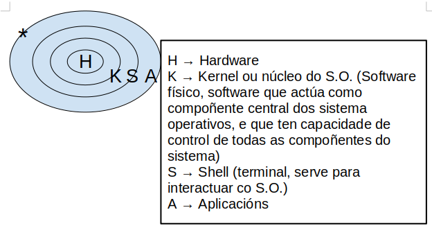

= Comandos ISO

== pwd 
En qué directorio estamos posicionados.

== clear 
Limpia pantalla.

== exit
Salir de la terminal.

== history
muestra el historial de comandos.

=== history -c
borra el historial de comandos.

== id 
Toda la información sobre nuestra cuenta: grupos, nombres y números.

[EXAMPLE]
====
usuario=número_de_grupo(nombre_de_grupo)
====

=== id -nu
Nombre de usuario; el parámetro (los parámetros van con guión) nu es "name user", y puede ir en diferente orden *-un*.

=== id -u 
Número de usuario.

=== id -g 
Número de grupo principal.

=== id -gn
Nombre del grupo principal.

* *groups:* Nos muestra todos los grupos a los que pertenece el usuario actual.

== uname
Muestra información sobre el sistema operativo. 
Nombre del sistema (Unix NAME). Se suele utilizar con parámetros, es raro usarlo solo.

=== -n 
Nodo. Es el nombre del PC. 

=== -o 
Nombre completo del Sistema Operativo.

=== -p 
Procesador. Muestra la arquitectura del procesador, p.ej: x86_64.

=== -r 
Release; versión del kernell, núcleo, del SO.

=== -a 
muestra todo (all). Muestra el nombre del kernell (Linux), el nombre del host, la 
versión del kernell, la arquitectura del hardware y la fecha y hora de compilación del kernell.

___

___

== date 
Nos muestra la fecha/hora.

=== date | tee fichero.ext
Mostrará la fecha y la hora actual en la pantalla y, al mismo tiempo, guardará esa información en un archivo llamado "fichero.ext".

== bc 
Entras a la calculadora. 

- Ctrl+D (^D) para salir.

== man
Manual del sistema. Va seguido del comando del que quieres saber la ayuda.

- Por ejemplo, *man date* Ayuda del comando date.

== info 
Información. Se basa en el man, pero suele ser más entendible. Es indistinto usar uno u otro, donde se encuentre mejor. Suele dar más ejemplos el info.
Al igual que _man_, se usa seguido de un comando:

- Por ejemplo, *info date*

[NOTE]
Para salir, tanto de _man_ como de _info_, hay que pulsar la _q_ de _quit_.

== whatis [...] 
Nos dice para qué sirve un parámetro, por ejemplo: *whatis pwd*.

== echo [...] 
Emite el mensaje que le pongas por pantalla.

== ls 
(Listar), nos muestra el contenido de donde estamos. Tiene una serie de colores (en Ubuntu al menos).

=== -a 
Nos muestra los ficheros y directorios, incluídos ocultos.

=== . 
Nos muestra lo del directorio actual, es lo mismo que no poner nada.

=== .. 
Nos muestra lo que hay en el directorio padre.

=== -A 
Lista los archivos y directorios en un directorio, excluyendo los directorios especiales " . " (punto) y " .. " (punto-punto). 

Estos dos directorios son referencias al directorio actual y al directorio padre, respectivamente, y se omiten en la salida cuando se utiliza ls -A. Muestra también los ocultos. 

Vamos, resumiendo, muestra lo mismo que el *ls -a* pero sin las referencias al directorio padre y el directorio actual.
    
=== -l 
Listado largo, tiene la mayoría de la información que estamos buscando: nombre, tamaño de la carpeta, hora y fecha de creación... Y el tipo de fichero que es (la _d_ es de directorio, el _._ un fichero oculto, la _ un fichero ordinario...) y los permisos (rwx), quién es el propietario del fichero y cuál es el grupo primario (el grupo que sale es el grupo principal que era en el momento de la creación).

[NOTE]
    El CHAR al principio del directorio en el *ls -l* hace referencia al tipo de archivo:
        
        d → directorio

        - → fichero ordinario

        l → link

        c → CHAR

        b →ficheros por bloque

        p → pipe

        s → socket

=== -1 
La lista la quiero en una columna; no existe el -2 xD. Obviamente si lo combinas con -l no hace falta porque ya lo saca en una columna, carece de sentido.

=== ls -d /ruta/al/directorio
El comando mostrará el nombre del directorio _/ruta/al/directorio_ en lugar de listar los archivos y subdirectorios que contiene.

=== ls / 
En este caso nos muestra lo que hay en la raíz del sistema; se puede poner otro sitio en vez de _/_, por ejemplo *ls /home -l*.

=== -M* 
Que liste todo lo que empiece por M. Si buscamos directorios hay que hacer el siguiente comando.

=== -d M* 
Especifica que buscas un directorio la _-d_. Con la -d te muestra tanto directorios como archivos-

=== ls -ld M* > Musica.vacio 
Te crea el directorio que le pones detrás del _>_

=== ls -ld \*ca* 
Que muestre lo que empiece como sea, que contenga _ca_, y que acabe como sea, como si no hay nada más del _ca_.

=== ls -ld *s > termina.s 
No lo mostrará por pantalla, porque le estás cambiando la salida al archivo que le mandas crear después del _>_.

=== ls -[DdEe]* 
Lista los elementos que empiecen con D, d, E o e. En el ejemplo se pone tanto minúscula como mayúscula porque discrimina estas.

=== ls -d [{CHAR}-{CHAR}]*
Lista elementos que empiecen por los CHAR(S) dentro de un rango. Es sensible a mayúsculas y minúsculas.
     
    ▪ Ejemplo: ls -d [A - E] → Buscará todo lo que contenga desde una “A” hasta una “E”
    
    ▪ Ejemplo: ls -d [A - EI]* → Buscará todo lo que acaba con una “A” hasta una “E” o acabe en una “I”

[NOTE]
Los parámetros se pueden combinar; por ejemplo: *ls -la*

[NOTE]
La ruta y el parámetro pueden ir uno delante del otro indistintamente: *ls .. -l* = *ls -l ..*

=== ls -ld \*[CHAR(S)-CHAR(S)]* 
Busca elementos que contengan caracteres de un rango determinado.

* Ejemplo: ls -ld *[0-9]*: busca elementos que contengan un caracter en el rango entre corchetes ambos inclusive → lista todos los elementos que contengan 0, 1, 2, 3, 4, 5, 6, 7, 8 y/o 9, independientemente de donde estén los números en el nombre del elemento.

=== ls -ld [*][.][?] 
Lista los elementos que después de un punto tengan determinado número de caracteres, determinados por el número de <?>.

=== ls -ld [^f]]* 
Lista los elementos que NO empiecen por _f_.

=== ls -ld {CHAR(S)}? 
Lista elementos que después del caracter contiene determinado número de caracteres, determinados por el número de <?>.
            
=== ls -ld *f*[0-9]* 
Lista los elementos que contengan un <f> y después, un número de 0 a 9, ambos inclusive.

=== ls -r
Hace un listado en orden alfabético inverso (Z-A)

=== ls -lR <directorio> 
R (de 🔁 recursividad) 
Ver todo el directorio y su contenido 	
        
=== ls -R
Registra todos los directorios de la raíz. Los ordena en orden alfabético
        ◦ 2> /dev/null: redirige la salida y descarta aquellos a los que no puede acceder, considerándolos como errores y la salida va a /dev/null, es decir, la “papelera”
        ◦ ls -lR / 2> /dev/null: hace un listado recursivo del directorio raíz (root), e indica que en caso de error, redirige a una salida

=== ls -id: muestra el inodo de un elemento
        ◦ para listar el inodo de los elementos dentro de un directorio, utilizamos los comodines
            ▪ ejemplo: ls -id *

[NOTE]
El inodo o i-nodo es un identificador único de un archivo o directorio, y es irrepetible. La única manera de que se repita es utilizando un enlace

== ; (Concatenación de comandos)
Para concatenar comandos, utilizaremos [;]
    • Por ejemplo: date; pwd; ls > informe.txt ejecuta los tres comandos juntos, seguidos y de manera independiente, pero solo redirige el último como salida a un fichero, y mostrando el resultado de todo
    • Ejemplo 2: (date; pwd; ls) > informe.txt ejecuta los tres comandos de forma simultánea y redirige la salida de los tres juntos a un fichero.
	
== </>/>> (Redireccionamiento)
    • < redirecciona la entrada
    • > redirecciona la salida hacia un archivo, si este existe, lo sobreescribirá, si no existe, lo creará.
    • >> redirecciona la salida, pero no sobreescribirá el archivo existente, sino que se añadirá al fichero al final. En caso de no existir el fichero, lo creará.

La mayoría de estos se usan para editar ficheros con cat
 
== tee
    redirecciona la salida a un fichero y luego lo muestra por pantalla
        ◦ tee - a fichero.extensión: redirecciona la salida, muestra por pantalla y añade contenido al fichero
            ▪ Ejemplo: date | tee -a informe.txt crea el informe.txt y le añade información resultante del comando date

== cat nombre.fichero 
Visualiza contenidos de un fichero (solo muestra el contenido)
        ◦ para crear un fichero, de manera interactiva, redireccionamos la salida del comando a un nuevo	fichero
            ▪ Ejemplo: cat > ejemplo.txt → Después Ctrl + D para terminar

=== cat -n
Enumera las líneas de un fichero
        ▪ Si nuestro fichero contiene los números rojo, azul y blanco uno en cada línea, visualizamos 1	rojo, 2 azul, 3 amarillo...
        ◦ cat {fichero1} {fichero2} >> {fichero3}: une dos ficheros, uno añadido al final del otro

== tac
Visualizar un fichero en orden inverso.
            ▪ Si nuestro fichero contiene los números 1, 2 y 3, uno en cada línea, visualizamos 3, 2 y 1.

[NOTE]
No se puede usar -n con el tac.

== history
Muestra un historial de los comandos utilizados hasta el momento

=== history -c 
Elimina todas las entradas del historial (_c_ de clean).

=== history {NUMERO} 
Muestra los últimos comandos del historial, el número de entradas es el establecido por el {NUMERO}
        ▪ Ejemplo: history 10: muestra los 10 últimos comandos utilizados.

=== history !{NÚMERO}
Vuelve a realizar el comando con este número en el historial.

== more 
Permite visualizar un fichero como listado largo, permitiendo saltar líneas o páginas enteras.

=== more +3 fichero.extensión
Muestra el fichero a partir de la línea 3, incluída.
Se puede poner cualquier número.

=== <comando> | more 
Para paginar un listado.

==== history | more 
Muestra el listado del historial de comandos en forma paginada.
Al pulsar [intro] vamos a una línea más abajo y  al pulsar [espacio] nos movemos una página entera, Para salir pulsamos [Q]

== less 
Permite visualizar un fichero paginado pudiendo ir hacia delante o hacia atrás en las páginas.

=== <comando> | less 
Para paginar un listado. Permite movernos hacia atrás.

* *cat nombre.fichero:* Visualizamos el contenido de un fichero ordinario.
* *cat > nombre.fichero:* Crear un fichero de forma interactiva; le vas a poner datos y los va guardando en el fichero; cuando quieras acabar, Ctrl+D.

___

Estos comandos están repetidos, no los borro por si acaso.

=== ls -l d-uno
Mostrar el contendio del directorio d-uno

=== ls -l d_uno/d_dos
Mostrar el contenido de d_dos.

=== ls -R / 2>/dev/null
Que haga un listado recursivo desde la raíz (/)
El 1 es para que muestre por pantalla, no es necesario porque lo pone por defecto. Pero el 2 es de error, y lo de null es papelera, para que se deshaga del error y lo mande a la papelera. 
Si quiero hacer un listado recursivo a partir del directorio actual, vale con no ponerle nada, o sino: *ls -R . 2>/dev/null*; y si quieres desde la raíz *ls -R / 2>/dev/null*

Con la -R va entrando en todos los subdirectorios desde la raíz y diciéndote qué hay en cada uno.

=== ls -r 
La r minúscula es de reverse, y va a ir de la Z a la A. 

[NOTE]
No confundir -R con -r, la primera es recursividad, la segunda es reverse, de la A a la Z-

___

== rmdir d_tres
Borra el directorio d_tres, pero tiene que estar vacío. Dará fallo si tiene contenido.

== rm -r d_uno 
Elimina el directorio aunque tenga contenido. Aquí la -r es remove, no reverse. 

___

Los siguientes vuelven a ser comando repetidos

== cat -n colores.txt 
El - n enumera las líneas del archivo.

== more colores.txt 
Nos permite ver un fichero por dentro a partir de cierta línea; por ejemplo, *more +3* muestra a partir de la línea 3, esta incluída.

== less colores.txt
Va igual que el more pero cambia algo que no se que es.

== ls -1 / | more +3
Vemos el listado a partir de la línea 3.

___

== cp colores.txt color.txt 
Copiar un archivo _colores.txt_ y guardarlo con el nombre _color.txt_.

=== cp colores.txt cinco/
Que haga una copiar de colores.txt en el directorio cinco/ 
Formato → *cp origen destino*
La "/" es opcional, va a entender que es un directorio aunque no se la pongas.

== mv colores.txt lista.color.txt 
Renombrar el archivo colores.txt a lista.color.txt. 
Con mover no generas nada, simplemente cambias el nombre del fichero. 
*mv* también renombra directorios: *mv seis dire*

=== mv planetas.txt dire/ 
*mv* también sirve para mover, aquí está moviendo el archivo planetas.txt al directorio dire/.

=== mv color.txt siete/color.siete.txt 
No solo lo mueve, sino que lo renombra a la vez.

=== mv *.txt ..
Cuando usemos comodines como mover todo lo que termine en .txt, puede dar problemas, sobre todo si en vez de en el origen como en el ejemplo, usamos el comodín en el destino. Verificar siempre con _ls_. Por ejemplo, si quiero coger todos los ficheros .txt y renombrarlos a .doc (*mv *.txt *.doc*) nos va a dar error, se piensa que *.doc es un directorio

=== cp ~/{c1.txt,c2.txt,lscolor.txt} .
Le estamos pidiendo que con una ruta absoluta vaya a home, y coja los tres ficheros que hay entre llaves y los copie aquí (.) OJO NO PONER ESPACIOS DESPUÉS DE LAS COMAS.

=== cp ../c1.txt ../c2.txt ../COLOR.txt ocho/
Es lo mismo, que copie los fichero del directorio padre (vamos, realmente el archivo está en el directorio donde estamos xd) y los copie a ocho/. Las rutas de origen pueden ser todas las que quieras, la que tenga cada archivo que quieres copiar, pero el destino tiene que ser el mismo para todos, solo puede ser uno.

== touch 
Crea fichero vacío; puede crear varios a la vez: *touch iso.txt fol.txt bases.txt*; si quiero crearlos en diferentes rutas, se especifica en cada fichero: *touch ../xbd.txt /../apuntes/fundamentos.adoc*.

== mkdir -p facturacion/compras/{C_2020,C_2021} 
La opción -p le indica a mkdir que cree todos los directorios necesarios en el camino especificado, incluso si los directorios padres aún no existen. Sin la opción -p, mkdir podría dar un error si intenta crear un directorio dentro de un camino que aún no existe.
Si todos los directorios en la ruta especificada ya existen, entonces puedes omitir la opción -p. La opción -p es útil para asegurarse de que todos los directorios en el camino se creen, pero si ya existen, no causará ningún problema.

== touch facturacion/compras/C_2020/{ene_2020.txt,feb_2020.txt,mazo_2020.txt}
Crear tres archivo a la vez en un directorio (destino{ficheros}); ojo a no poner espacio después de las comas.

[NOTE]
Ojo a no poner espacios en blanco después de las comas en lo que va entre llaves {}

== file
Te dice el tipo de archivo que es.

=== file *
Te dice qué tipo de archivos son todos los del directorio actual.

=== file archivo.txt
Te dice qué tipo de archivo es el que tú le pones.

___

== Cambiar fecha a un archivo

* *ls -l colores.txt:* puedes ver por ahí la fecha.
* *touch colores.txt:* haces un touch al fichero que ya existe.
* *ls -l colores.txt:* ahora la fecha es otra.

=== touch -c colores.txt 
Así es mejor cambiar la fecha, porque como no exista el archivo y no le pongas el -c, te lo crea; en caso de que no exista, con el -c no crea nada.

=== touch -t 12311200 colores.txt
Cambias la fecha al archivo, el formato de la fecha es mmddhhmm -mes, día, hora, minuto-). Se puede añadir año al principio (touch -t 2004011200 colores.txt pondría el año 2020 -solo se pone el 20-), sino asume que es el actual; si no pones hora suele poner las 12pm.

La -t es de _timestamp_.

El comando touch en sistemas Unix y Linux permite especificar una marca de tiempo específica utilizando la opción -t. Puedes usar el formato [[CC]YY]MMDDhhmm[.ss], donde:

CC es el primer componente del año (siglo).
YY es el segundo componente del año (dos últimos dígitos).
MM es el mes.
DD es el día.
hh es la hora.
mm es el minuto.
.ss es opcional y representa los segundos.
Por ejemplo:

[source, bash]
----
touch -t 202311152030.00 colores.txt
----

=== touch -r color.txt colores.txt 
La -r es de referencia, color.txt es el archivo al que hace esa referencia, y colores.txt el archivo al que va dirigido; así, la fecha y hora del archivo color.txt será también ahora la fecha de colores.txt.
Funciona también con directorios, eh.

___

== Enlaces

Tenemos dos tipos de enlaces:

=== Simbólicos

Lo que en Windows son los accesos directos; acceso directo a un fichero o a un directorio. Trabajan sobre:
    - Ficheros
    - Directorios

[source,bash]
----
ln -s facturacion/compras/c_2020/ enlace_c_2020
----

Primero se pone la ruta donde va a dirigir el link, y después el nombre que queramos.

Ahora cuando quiera cambiar a ese directorio, usaremos cd con el enlace:

[source, bash]
----
cd enlace_c_2020
----

Y al hacer *pwd* veremos que nos ha llevado a la ruta del enlace.

Si en vez de a un directorio el enlace es a un fichero, un cd nos dará error porque no se le hace cd a un fichero ordinario, pero se podría hacer un cat al enlace, por ejemplo.

Si queremos borrar los archivos que hay en esa ubicación.

[source, bash]
----
rm enlace_c_2020/*
----

Y nos eliminará todos los archivos, pero nos dejará el accesos directo, solo que ahora es inservible.

Si además eliminas el directorio de la ruta, cuando haces un ls -l el enlace aparece en rojo y negro, porque es inservible; por eso habrá que eliminar el enlace.

[source, bash]
----
rm enlace_c_2020/
----

Se elimina normal porque para Linux es un fichero más.

=== hard link 

Solo trabajan sobre *FICHEROS*.

[source, bash]
----
ls -id *
----

El -i es de inodo (y la -d de directorio), es como el DNI de una entrada, un número que no se repite. Si sacamos cada inodo de cada entrada. No es solo un número, contiene una serie de información donde guarda ese número de inodo, el nombre del fichero o directorio, el tipo, cuándo fue creado, por quién. cuando se modificó por última vez, cuándo se accedió por última vez en solo lectura...

En el caso de los enlaces duros, los inodos se repiten, es la única excepción que tenemos, el inodo es por esencia irrepetible.

En Windows esto no existe.

La idea es la siguiente, crear un fichero y todo el mundo accediendo a él, y modificando. Si uno lo modifica, entra la modificación a todos. Todos ven las modificaciones, porque el fichero es uno, aunque tengamos cada uno el fichero en su propia carpeta personal.

* *ls -lih:* vas a ver los números de inodos y los KB que ocupan. La -h es de humanizar, para que te lo muestre en una medida que entiendas.

Para crear un enlace duro:

[source, bash]
----
ln /home/asir1/colores.txt colores.txt
----

El fichero está en el sistema una sola vez, no repetido tantas veces como ln se hagan. 

___

== wc datos.txt
El comando wc (word count) en Unix y sistemas similares se utiliza para contar palabras, líneas y caracteres en un archivo. Si ejecutas el comando wc con el nombre de un archivo, proporcionará tres valores por defecto: el número de líneas, el número de palabras y el número de caracteres en ese archivo.

=== wc -l datos.txt
Cuenta las líneas que tiene el fichero datos.txt.

=== wc -w datos.txt
Cuenta las palabras del fichero datos.txt; solo cuenta las palabras por espacio, es decir, si tenemos maria:blanco:negreira:1500 solo lo toma como una palabra.

=== wc -c datos.txt
Cuenta los caracteres del fichero datos.txt.

** **wc -L datos.txt:* 
Nos dice cuántos caracteres tiene la línea más larga del fichero datos.txt.

[NOTE]
Estos parámetros se pueden combinar, por ejemplo, si quiero saber el número de caracteres que tiene la línea más larga, y a la vez el número de caracteres del archivo, usaría *wc -L -c datos.txt*.

=== wc como filtro
wc puede usarse, además de como comando, como filtro.

* *ls / | wc* 

* *ls / | wc -l*

Dos métodos para ver el número de líneas de un fichero:

* Como comando: *wc -l reporte.txt*

* Como filtro: *cat reporte.txt | wc -l*

Ambas hacen exactamente lo mismo.

Y si uso el *tac* para que las cuente al revés lo mismo, da igual que las cuente de un lado o de otro que son las mismas.

=== wc -l reporte.txt datos.txt
Me cuenta las líneas de los dos ficheros y además me hace la suma.

=== wc -lc /etc/*
dará una salida que incluye el conteo de líneas y caracteres para cada archivo individual en ese directorio y sus subdirectorios, así como el total acumulado al final. Muchos son directorios por lo que dará errores.

=== wc -lc /etc/* 2>/dev/null:
Así, todos los errores no se muestran.

=== Paginarlo
La salida es larguísima, por lo que podemos usar un filtro para paginarla.

* wc -lc /etc/* 2>/dev/null | less:

* wc -lc /etc/* 2>/dev/null | more:

___

== Unir varios ficheros

Tengo dos ficheros: datos.txt y reporte:

* *cat datos.txt reporte > reporte.datos:* se añade el segundo debajo del primero en un nuevo fichero llamado reporte.datos. El orden en el que se escriben los ficheros es importante.

* *cat dichos_3.txt >> dichos.txt:* así unes el fichero dichos_3.txt con el ficheros dichos.txt; queda el fichero dichos.txt con su contenido original y al final se le ha añadido el contenido del fichero dichos.3.txt.

[NOTE]
Con el > lo que haces es meter el contenido en el fichero tal cual, es decir, vas a sobreescribir el contenido del fichero de destino (a no ser que no exista, entonces crea uno nuevo y da un poco igual); con el >> lo que haces es añadir el nuevo contenido al fichero de destino, es decir, el fichero de destino queda igual que estaba y además se le añaden al final nuevo contenido.
___

== cat -n reporte.datos
Enumera cada una de las filas, es solo visual y no modifica el fichero.

== head -5 reporte.datos
Quiero ver, desde el top (head, cabecera) las cinco primeras líneas, se puede poner cualquier número, empieza desde la cabecera y va cogiendo las cinco primeras líneas. Si no pongo ningún parámetro va a mostrar 10 líneas.

[NOTE]
---
El head funciona como comando y como filtro: cat reporte.datos | head -3
---

== tail -2 reporte.datos
Funciona al revés que el head, desde abajo. Muestra también 10 por defecto si no le indicas parámetro.

=== cat -n reporte.datos | head -5 | tail -2
Si queremos que solo nos muestre las líneas 4 y 5, le pedimos dos filtros a la vez: el del head nos muestra hasta la línea 5, y ahora el tail nos muestra solo la 5 y la 4 que son las dos primeras desde abajo.

=== tail +4 reporte.datos 
En vez de poner un - pongo el + para decirle que se posicione en la línea 4; va a mostrar *desde* línea 4; hace lo mismo como filtro *cat -n reporte.datos | tail +4*; si además se le añade un filtro head -2 te coge las dos primeras líneas de las que filtró. Quedaría *cat -n reporte.datos | tail +4 | head -2* 

=== head -1 * 
Te muestra la primera línea de todos los ficheros que hay en el directorio actual. Puede usarse cualquier comodín, por ejemplo, head -1 rep*; con los directorios dará error, así que se le puede añadir esto: _head -1 * 2>/dev/null_

___

Lo normal en Linux para separar campos son los dos puntos:

_maria:blanco:negreira:1500_

Si tengo un fichero con varios registros como el anterior, y quisiera guardar en otro fichero todos los nombres de la primera columna (maria en el registro de ejemplo), usaríamos el comando _cut_ para cortar la columna.

== cut -d: -f1 datos.txt > usuarios.txt 
La -d es el delimitador, donde va a cortar, en este caso le indicamos que un campo termina con los dos puntos; la -f es de field, campo, y le decimos que queremos que saque el primer campo (maria). 

=== cut -d: -f2 datos.txt | tee colorin.txt
Aquí usamos el tee; el -f2 solo coge el campo 2 eh, no el 1 y el 2.

=== cut -d: -f1,4 datos.txt 
así es solo visual, no lo estamos guardando en ningún sitio, lo que si en el parámetro -f le estamos diciendo que queremos dos campos, el 1 y el 4.

=== cut -d: -f1-3 datos.txt
Con el guión en vez de la coma, lo que indicas es un rango, coges de la columna 1 a la 3.

== cut también funciona como filtro:

=== ls -l | cut -d " " -f1 
Aquí le pido un listado largo, y le filtro con el delimitador espacio y columna 1. Ojo con dejar espacio entre la d y la comilla de apertura, no pegarlos nunca. (En este caso va a pasar una cosa no deseada, y es que algunas columnas del listado tienen dos espacios de separación entre ellas, por ejemplo cuando en una columna hay números, algunos son de 3 cifras y otros de 2, por lo que los de 2 tienen un espacio en blanco de más, y cuenta otra columna de más).

=== ls -l | tee nombre.fichero
Muestra el ls por pantalla y a la vez lo guarda en el archivo nombre.fichero.

___
== sort datos.txt
Ordena el fichero, sin ningún parámetro simplemente toma el primera caracter de cada registro y lo ordena.

=== sort -t: -k2 datos.txt 
Aquí la -t es el delimitador, entonces le estamos diciendo que los dos puntos son el delimitador, la -k es de clave, queremos la segunda clave (el segundo campo); entonces ordena en función de la segunda columna.

[NOTE]
Mucho cuidado con confundir los delimitadores y campos/claves entre cut y sort; en cut el delimitador es -d de delimitador, mientras que en sort es -t de separator; en cut el campo es -f de field, en sort es -k de key.

=== sort -t: -k4 -n datos.txt
Para ordenar por campos numéricos, lo que haría normalmente es ordenar por primer caracter, y tomaría primero el 1100 antes que un 990, por el 1 y el 9. Por eso hay que añadir el -n de numérico.

=== sort-t: -k4 -nr datos.txt
La -r es de reverse, lo ordenará de mayor a menor.

___

sort puede actuar como filtro:

=== cut -d: -f3 datos.txt | sort

=== cut -d: -f3 datos.txt | sort | uniq
Así no habrá datos repetidos.

=== cut -d: -f3 datos.txt | sort | uniq -u 
Con -u nos muestra solo datos que no se repiten.

=== cut -d: -f3 datos.txt | sort | uniq -c 
cuenta cuántas veces se repite cada resultado.

[NOTE]
Siempre que usemos _unique_ es importante usar el _sort_ antes, porque lo que está comparando el _unique_ es la fila de arriba con la de abajo, y si no están ordenados, va a mostrar repetidos:
ames
ames
ames
negreira
santiago
santiago
Así compararía santiago con santiago y ames con ames con ames. Si no está ordenado,  no los compara.

=== cut -d: -f3 datos.txt | sort | uniq -c | cut -d " " -f2 
Así no nos muestra la columna que queremos porque hay varios espacios antes y toma más columnas de las que queremos.

=== cut -d: -f3 datos.txt | sort | uniq -c | cut -d " " -f8 
Así sí, porque está en la columna 8 realemnte con lo de los espacios.

=== cut -d: -f3 datos.txt | sort | uniq -c | cut -c 9-20 
Así le pedimos que coja a partir del carácter 8 y coja hasta el 20, en vez de usar delimitadores. 

=== cut -d: -f3 datos.txt | sort | uniq -c | cut -c 9-20 | tee ciudades.txt
Así además lo guardamos en un fichero ciudades.txt.

=== ls -l | cut -d " " -f3 | tail +2 | sort | uniq -c | tee usuarios2.txt: 
me sale cuántos usuarios diferentes hay en el listado y cuántas veces se repiten.

___

== cut -d: -f1 datos.txt > estado.civil
Cortamos la columna que queremos y la guardamos en un fichero.

== paste -d: datos.2.txt estado.civil | tee datos.3.txt
Si no lo guardas, el paste es solo visual. 
Para usar el paste lo mejor es crear un archivo temp antes con lo que queremos pegar.
El -d le pones tu el que quieras para que cuando lo pegue, use ese delimitador.

=== cut -d: -f4 datos.3.txt | sort -n -r | head -1
=== cut -d: -f4 datos.3.txt | sort -n | tail -1

Ambos comandos nos devolverían lo mismo, en uno usamos reversa y otro no, así que filtramos el primero por el principio o por el final dependiendo.

[NOTE]
_cut_ trabaja como comando y como filtro.

cut -d: -f5 datos.3.txt | sort | uniq -c | head -2 | tail -1

== tr [A-Z] [a-z] < datos3.txt > datos.min.txt
tr es un traductor; todo lo que está en mayúsculas lo ponga en minúsculas. Necesita obligatoriamente un redireccionamiento de ENTRADA (<); 

=== tr ":" "*" < datos.3.txt 
Que cambie todos los : a *. Aquí es solo visualmente el cambio.

=== tr [A-Z] [a-z] < datos.3.txt | tr ":" "*"
Doble traducción, no hace falta poner otra vez el archivo.

También funciona como filtro:

=== cat datos.3.txt | tr [A-Z] X 
Que todas las mayúsculas las cambie por una X.

=== cat | tr -d [A-Z] 
El -d es de delete, y borrará todos los caractéres que estén en mayúscula.

[NOTE]
El archivo de entrada y salida no puede ser el mismo, porque entonces habría un bucle ahí que no funcionaría, queda el archivo en blanco.

___

== ls -l | tr -d ' ' | cut -d ' ' -f6 
Aquí al quitar los espacios nos queda solo una columna.

=== ls -l | tr -s ' ' | cut -d ' ' -f6
Aquí el -s nos quita solo los espacios repetidos, que es lo que necesitamos justo para esto.
La -s es de squeezing y es la que se encarga de eliminar repeticiones de caracteres

=== ls -l | tr -s ' ' | cut -d ' ' -f6 | sort | uniq -c 
Aquí nos diría cada mes y cuántos salen por cada mes.

=== tr -c [a-z] " " < prueba
El -c es de contrario, va a reemplazar todo lo que no sea minúsculas de la a-z por un espacio en blanco. Lo contrario no son solo las mayúsculas, también números, signos de puntuación... cualquier caracter que no esté entre a-z.

___

== uname -v 
Muesta la fecha de la última compilación del kernell.

___

== grep blanca datos 
Nos va a permitir buscar palabras en ficheros; pueden ser palabras enteras, partes de palabras... El orden es _grep → lo que busco → dónde lo busco_.
    
=== grep bla datos 
En este caso nos devolvería tanto blanca, como blanco.
    
Discrimina entre MAY y min, si tengo MARIA en un fichero, pero busco grep maria datos, no nos lo encuentra. Por eso:

=== grep -i maria datos 
-i de ignore-case, va a darle igual ahora si son MAY. o min.
    
=== grep -i maria datos datos.txt datos.2.txt 
Puedes buscar en varios ficheros a la vez. En la salida de la terminal va a mostrar el nombre del fichero donde aparece y la línea donde aparece en ese fichero.

=== grep -i maria datos*
aquí nos trae lo mismo que el anterior, pero como usamos el comodín no hace falta escribir los tres archivos, ya entiende que estás buscando en todos los ficheros que comiencen por _datos_.

=== grep -i "Juan Carlos" dat*
En caso de que lo que busquemos tenga espacio en blanco, es OBLIGATORIO meterlo entre comillas, porque si no va a entender que lo que va despues del espacio en blanco es el archivo.

=== grep -ic maria dat*
El -c es un contador, entonces nos dice las ocurrencias, es decir, cuántas veces aparece el texto "maria" en cada fichero. La terminal devolvería algo similar a esto:
                datos:1
                datos.2.txt:1
                datos.4.txt:0
                datos.min.txt:1
                datos.txt:1

=== grep -icv ia * 
Con el -v de invert-match hace lo contrario, cuenta las líneas donde NO aparece.    
    
=== grep -in santiago datos 
El -n númera la línea en la que está lo que busco.

___

También funciona como filtro el grep

== ls | grep -iA 1 os 
La -A es de after, y lo que hace es traer lo que buscas con el grep y, además, una línea después. El 1 puede ser cualquier número, y entonces serían las n líneas anteriores.

=== ls | grep -iB 1 os 
La -B es de before, y lo que hace es traer lo que buscas con el grep y, además, una línea anterior.

=== ls | grep -iC 1 os
La -C es lo que hace es traer lo que buscas con el grep y, además, una línea después y una línea antes. La -C es por A, B y C.

=== grep -in ^a color.txt: busca las líneas que comiencen por a. Es la línea, no la palabra.

grep -in ^a..l$ color.txt: busca las líneas que comiencen por a, contengan 2 carácteres y finalicen con l.

[NOTE]
^ Para indicar el comienzo.
. Para indicar cualquier caracter.
$ Para indicar el final.
* Para indicar un número indeterminado de caracteres.

=== grep -in ^m..*o$ 
el asterisco es para indicar que después de los dos caracteres que siguen a la m, vienen más caracteres, pero no se cuántos son.
Es aconsejable poner entre "" la palabra que buscamos cuando escribimos caracteres especiales como *, en algunas terminales podría dar error si no.

=== grep -in ^m.*ia datos
Luego puedes poner tú las combinaciones que necesites.

=== ls | grep [0-9] 
Buscamos todas las entradas que contengan un número en el nombre.

ls | grep -i s[0-9]: delante del número tiene que haber una s.

ls | grep -i ^[ce]......: la palabra que busco empieza o por c o por e, y luego tiene tantos caractéres como puntos como mínimo. Es la longitud mínima lo que le indicas, luego puede ser mayor lo que te devuelva.

    ls | grep [24]: busco una entrada que contenga o el 2 o el 4.

[NOTE]
Cuando escribo algo entre los corchetes se lee de forma individual.

    ls | grep 24: si quisiese buscar un 24 lo pondría así.

    ls | grep ^[a-fA-F]: que empiece por algo que sea de la "a" a la "f" o de la "A" a la "F". En este caso es válido también ls | grep -i [a-f]

    ls | grep -i [aeiou]$: que termine en vocal. Que sería lo mismo que ls | grep [aeiouAEIOU]$

    ls | grep -i [aeiou]...$: empezando por detrás, el cuarto es una vocal.

    ls | grep -i [aeiou][aeiou]: contiene dos vocales juntas, en cualquier posición.

    ls | grep -i [aeiou][aeiou]*: una vocal y la segunda puede que no aparezca.

    ls | grep -i [aeiou][aeiou][aeiou]*: dos vocales obligatorias y la tercera puede que no aparezca.

    La que está pegada al asterisco es opcional, puede que no aparezca ninguna vez.

    ls | grep -i ^[^a-e]: que NO empiece por ninguna letra de la a a la e.

    Dentro de los corchetes, el circunflejo ES NEGACIÓN
    

    ls -a | grep "^\.": el punto hay que escaparlo para que no interprete que es un caracter cualquiera, sino que es un punto lo que buscamos.  SIEMPRE que escapemos algo, hay que meterlo entre comillas.

    ls -a | grep "^[^\.]": que no empiecen por punto

    ls | grep -i "\(tos\|tad\)": estoy buscando que tenga tos, o que tenga tad; el | no es un filtro, es un "o", por lo que hay que escaparlo; además hay que meterlo entre paréntesis para que sepa que es lo que buscamos, lo que pasa que hay que escapar también estos paréntesis, y debemos meterlo entre comillas porque está escapado; puede contener ambas, tanto tos como tad.

___

grep asir1 /etc/passwd: con esto nos trae la línea que queremos de nuestro usuario.
grep -on asir1 /etc/passwd: nos dice en qué línea aparece asir1.
grep asir1 /etc/passwd | cut -d: -f7: con este filtro sabremos con qué shell estamos trabajando.

passwd: cambia la contraseña

ls -l /etc/passwd
ls -l /etc/group
ls -l /etc/shadow: aquí, al contrario que en los anteriores, nos dice que pertenece al grupo shadow. Además tiene otros permisos.

los tres permisos son escritura (w), lectura (r) y   (x).

Los tres primeros caractéres pertenecen al propietario; los tres siguientes al grupo; los últimos a otros.

umask: visualizar la máscara que tenemos. 

La máscara se calcula sobre los ficheros:

rw-rw-rw-
110110110
 6  6  6

Ese es el valor más alto que se le puede dar a un fichero, 666 (para directorio es 777).

rw-r-----
110100000
 6  4  0

Ahora al valor más alto le restamos el nuestro, y ese es nuestro número de máscara (026). 

[NOTE]
Una máscara SIEMPRE es un número par.

umask 026: cambiamos a esa máscara.
touch abc.txt: creamos el archivo abc.txt
ls -l : vemos los permisos de abc.txt → -rw-r-----

mkdir adir: creamos un directorio
ls -ld adir/: vemos los permisos de adir → drwxr-x--x

Tan pronto cerremos la terminal, la máscara se borra, porque la máscara está en un . fichero de configuración.

En caso de querer dejarla fija:

ls -la: vemos ficheros como el .bash_history, que es donde se guarda el historial de comandos para cuando usemos el comando history. .bashrc y .profile guardan tipo de letra, color de fondo de la terminal...

less .bashrc → los valores en mayúscula con un = después son las variables del sistema. Cuando hay # significa comentario.

vi profile → vamos hasta la máscara, descomentamos la línea donde está la máscara, la modificamos por 026 y guardamos con :wq. 

exit

abrimos de nuevo; y verificamos:

touch abcd.txt
ls -l abcd.txt: los permisos son -rw-rw-r--

chmod: cambio en los permisos.

Hay dos modos de cambiar los permisos, con octal o con forma simbólica.

chmod g+w,o-w dos.txt: le agregas permiso de escritura y le quitas el de escritura.

imaginando un fichero con los permisos r--r----- en el que vemos los permisos, podría hacerse con el modo octal:

chmod 660 dos.txt

chmod 770 dir: esto es cambiar permisos a un directorio con modo octal.

chmod -R 660 dir/*: para los directorios (para los DIRECTORIOS) tengo una recursiva, -R. Cambia todos los permisos de lo que contiene el directorio.

___

== /bin/su

En bin están los comandos, el comando su se utiliza para cambiar de cuentas de usuario.

En permisos de este comando aparece una "s", son los permisos especiales, vienen por defecto.
En vez de _rwx_, tienen _sst_.

En este caso la "s" la tiene el usuario propietario, es un *permiso de sustitución*; en ese fichero, por unos segundos, va a sustituir al root, porque necesita hacer una comprobación en el fichero "shadow", por lo que por unos segundos hace esa lectura en ese fichero para comprobar que la contraseña es correcta.

Mirar diferencia entre s y S.

== /tmp

Este es el directorio temporal. Cada app que abrimos crea ficheros temporales, que al cerrar el programa, se destruyen. Si guardamos cosas en este directorio, al reiniciar el sistema, se borran. Tiene todos los permisos y además, en la última posición, tiene una "t".

Mirar diferencia entre t y T.

La t es lo que se conoce como sticky bit.
BUscar qué es.

Limita las escrituras, puede ser sobre fichero o directorio, y significa que pueden modificar pero no eliminar.

Es útil por ejemplo si compartes una carpeta con un grupo, para que puedan editarlo pero no lo eliminen.

___

Si están en mayúscula es que por debajo no hay permisos de ejecución, si están en minúscula, es que sí.

sst 
ugo (usuario, grupo, otro)

Añadir permisos sería:

chmod u+s nombre.txt → para el usuario
chmod g+s nombre.txt → para el grupo
chmod o+t nombre.txt → para otros

y todos juntos:

chmod u+s,g+s,o+t nombre.txt

chmod o+w,+t nombre.txt: añades los dos permisos a otro

https://www.ionos.es/digitalguide/servidores/know-how/asignacion-de-permisos-de-acceso-con-chmod/

___
comando cuando estamos conectados (lo de remmina)

w: de who, muestra quién está conectado

tenemos tambien el who

who -T: el signo + o - nos muestra qué terminales pueden recibir mensajes con el wall; las que estan con + son las que si

who -q: cuántos usuarios están conectados a la terminal.

who | grep pepito: comprobar si pepito está conectado.

who | grep ^a: comprobar los usuarios conectados que empiezan por a.

who | grep pts/7: qué usuario está en la pts 7

who | grep 192.168.1.42. ver quién está conectado con esa IP.

last -2: los dos últimos en conectarse. Puede ponerse el nº que se quiera.

wall: comando para mandar un mensaje a todos

mesg: si sale _y_, es que sí puede recibir interrupciones del wall; 

mesg n: apagamos el wall para que no me lleguen mensajes del wall

mesg y: encendemos para poder recibir mensajes

mail: la primera vez puede salir que no tengo correo

mail nombredeusuario: enviar un mail a alguien; para enviar es control+d

la _q_ para salir del mail

ls -l /home: la configuración aquí es distinta, están las personas agrupadas por letra, salvo la cuenta principal que está aparte.

cd /home/asir1: permiso denegado

192.168.1.90 → nada esto no es para estudiar es solo una nota

tty: ver donde está mi pseudoterminal, la mía es la 17.

whoami: quién soy o con qué nombre me he logueado. Útil para cuando manejo varias cuentas a la vez.

ls

___

https://blog.alcancelibre.org/staticpages/index.php/permisos-sistema-de-archivos

___

para buscar cinco caracteres hay que hacerlo de diferentes maneras en ls que en grep

ls ?????
grep .....

y el asterisco significa diferente

ls ?????*
grep .....*

se supone que estos dos son los errores mas grandes y fijo q algo asi cae en el examen

ls ^???$ → esto es INCORRECTO porque no funciona con el ls, el ^ y el $ son para el grep

el -i en el grep es para que no distinga may. y min., pero en el ls son los inodos.

___

find /home: nos va a permitir encontrar o buscar cosas. find + ruta a partir de donde vamos a buscar

find ~ -atime 7: aquellos que fueron accedidos, por ejemplo los que leí, desde hace 7 días; el 7 puede ser otro número obviamente. a de accedido.

find ~ -atime -7: los de menos de 7 días.

find ~ -atime +10: aquellos de más de diez días.

find ~ -atime 0: en las últimas 24 horas.

find ~ -mtime 4: modificado en los últimos 4 días. m de modificado.

find ~ -name "d*": sigue las mismas reglas que usa el ls. aquí le pedimos que busque lo que empiece por d. Para que termine por d, "*d".

[NOTE]
Cuando hay un caracter especial como un *, hay que ponerlo entre comillas

find /etc -name "passwd": para buscar nombre del fichero que se llame passwd

find /etc -iname "passwd": sin importar may. y min.

find ~ -iname "passwd" 2>/dev/null: así no nos da los permisos denegados, los manda a la papelera.

find /etc -user felipe: buscar lo que le pertenece a un usuario.

find /etc -group nombregrupo: buscar lo que pertenece a un grupo de usuarios. Está bien añadirle el 2>/dev/null.

find . -group asir1 -user asir1 -iname "f*": tiene que cumplir todas las condiciones, que pertenezca al grupo asir1, al usuario asir1 y el nombre del archivo empiece por f. Se tienen que cumplir las tres (AND).

find . -iname "f*" -type f: el type es el tipo de archivo, en este caso es un fichero (f). Se puede poner l (enlace simbólico), 

find . -type f -nouser 2>/dev/null: un fichero que no tenga propietario.
find . -type f -nogroup 2>/dev/null: un fichero que no tenga grupo.

Cuando eliminas un grupo, o usuario...el sistema pone un número largísimo al propietario de los archvios que pertenecían a ese grupo o usuario (o queda en blanco), y ahora no tienen grupo o usuario. Por eso hay archivos sin propietario o grupo.

find . -type f -size 4c: un archivo cuyo tamaño sea 4 caracteres
    4b: 4 bloques
    1G: 1 giga
    1k: 1 kilo

    Puede ser +1k, -1G... igual que el -atime. El = es sin nada.

find . -type f -size +1k -size -10k: para buscar en un rango de tamaño hay que usar el -size dos veces.

    el -size 0 es igual que usar -empty, buscar un archivo vacío:

find - -type f -empty

find - -type f -executable 2>/dev/null: fichero ordinario que sea ejecutable (que tenga permisos de ejecución).

find /var -perm -1000: perm de permisos. Usar sin el -type, para que funcione. No deberían ir juntos. Con un permiso -1000 busco que tenga un sticky bit. Puede ir el numerito con +, con - o sin nada. Los 0s los ignora.

find /var -perm 777: entradas que tengan esos permisos 777, por lo general con 777 son scripts o executables.

___

find . -type f -size -10k -o -empty: el -o es un OR, va a traer los archivos menores de 10k y los vacíos.

find . -type f -empty -perm 664: así es el AND, que estén vacíos Y tengan permisos 664. Así va a entrar en rutas, si solo quiero que me busque archivos del primer nivel y no entre en todos los subdirectorios, hay que limitar la profundidad, agregando *después de la ruta* -maxdepth 1.

find . -maxdepth 1 -type f -empty -perm 664: la profundidad OBLIGATORIAMENTE tiene que estar después de la ruta. Profundidad 1 es el directorio actual.

Si pongo -maxdepth 2 me llegará hasta el nivel 2, pero me incluye el 1 y el 2, en caso de que solo quiera el segundo nivel:

find . -mindepth 2 -maxdepth 2 -type f -empty -perm 664: así afinamos más. Como se dijo antes, la profundidad siempre va después de la ruta.

find . -maxdepth 1 ! -type f -empty -perm 664: el ! es negación, es decir, que no sean ficheros, pueden ser directorios. Solamente niega el tipo. Siempre hay un espacio después de la !. Si quisiese que afectase a todos, tendría que poner ! delante de todos.

find . -maxdepth 1 -type f -empty -name "[rR]*"
find . -maxdepth 1 -type f -empty -iname "r*": es lo mismo que lo de arriba, con el iname no discriminar entre may. y min, con el name a secas puedes pedirle que empiece o por r o por R que es lo mismo.

___

find . -maxdepth 1 -type f -empty -name "[rR]*" -exec rm {} \;: después del -exec siempre va a ir un comando, que es el que queremos que se ejecute. En este caso va a borrar todo lo que está entre las llaves, y en este caso es la lista que ha encontrado el find. Tenemos que poner punto y coma para señalar donde acaba lo del -exec, pero como por lo general el ; en linea de comandos se usa para separar un comando de otro, hay que escaparlo.

find . -maxdepth 1 -type f -empty -name "[rR]*" -exec chmod 666 {} \; 2>/dev/null: aquí le pedimos que cambie los permisos a 666 a los arvchivos que encuentre con el find, pero si alguno no te deja cambiarlo que no lo muestre y lo mande al devnull ese.

___

find . -maxdepth 1 -type f -size +0 -name "r*" -exec ls {} \; | head -1: el -size +0 es lo mismo que ! -empty; quiero que me haga un ls de esa búsqueda. Y luego le metemos el filtro head -1 para que muestre solo el primero que encontró, es el primero de lo que está en las {}.

find . -maxdepth 1 -type f -size +0 -name "r*" -exec head -1 ls {} \;: esto en cambio es diferente al anterior, porque primero hace el head. Va a ejecutar el head tantas veces como ficheros haya encontrado, con la primera linea de cada fichero.

Esto pasa con el head, con el tail...alguno más por ahí.
___

find / -maxdepth 1 -links +3 -exec ls -l {} \;: el error más común es poner link en singular, pero es *links*. Buscar lo que es porque no lo sé. Creo que pone el número de enlaces que tiene cada fichero o algo así. Puede ser +3, -3, 3... con el número que sea.

find / -maxdepth 1 -links +3 -exec ls -l {} \; > informe.raiz: así lo guardamos.

Podemos guardarlo sin erroreS: find / -maxdepth 1 -links +3 -exec ls -l {} \; 2>/dev/null > informe.raiz

[NOTE]
Cuando Rosa pida buscar ficheros no hay que poner el -type f; el -type f hay que ponerlo cuando pida ficheros ORDINARIOS. Esto es por lo de que para Linux todo eran ficheros.

[NOTE]
El enlace duro si lo queremos buscar es un -type f, a diferencia del enlace blando que es -type l

___

alias
Nombres que le ponemos a algo, para no olvidarnos, por ejemplo, en vez de estar todo el rato poniendo _clear_, me creo un alias más corto y lo uso cuando quiera ejecutarlo.

alias c="clear"

Una vez cierre la consola, cuando vuelva a abrirla ya no estarán, se habrán borrado.

Existen ya unois alias predefinidos por Ubuntu, cuando hacemos un less ~/.bashrc se pueden ver, casi al final, algunos. Por ejemplo, hay un alias _la_ para el comando _ls-A_.

Si editamos este fichero y añadimos nuestros alias personalizados, sí que quedarán permanentemente guardados. Si no quiero utilizar alguno, o bien lo elimino, o bien lo comento con # (es lo más sensato).
Habrá que reiniciar la terminal porque el fichero .bashrc se carga al abrir la terminal.

=== alias contar="echo Hay `ls | wc -l` entradas en mi directorio `pwd`"
Lo que va entre `` sería como una variable. Es el acento de la derecha de la P.

== unalias contar
Eliminar el alias. Se elimina el de memoria, si lo creamos editando el archivo .bashrc no se eliminaría con este comando, habría que ir al archivo para eliminarlo.

== alias vs="pwd; id; echo hola"
Se puede guardar un alias con comandos concatenados. Nos haría los tres comandos al ejecutar el alias.

___

Variables de usuario

== nombre="Felipe"
Se declara una variable.

== echo $nombre
Visualizamos el nombre de la variable.

Puede usarse un echo con el texto que sea y meterle las variables que quieras por medio.

=== echo Me llamo $nombre y mi pc es el `tty`
Aquí usamos tanto variable como comando tty para que nos diga el nombre y el pc que usamos.

=== a=`pwd`
Guardamos una variable con un comando. Cuando invoquemos la variable va a ejecutar ese comando.

=== echo \$a = $a
A veces necesitaremos escapar el $ para que no lo tome como variable.

=== a=
Así no se borra la variable, así ahora la variable va a estar vacía, pero seguirá estando en memoria

=== unset a
Así sí, la variable queda borrada.

___

Variables de entorno

== set | less
ves variables de entorno y scripts

== env | less
Este solo las variables de entorno; env de enviroment.

A diferencia de las variables del usuario, las variables del sistema están en mayúsculas. 

== echo $HOME
Nos mostraría nuestro home.

== set | grep ^HOME
Buscar la variable HOME.

== env | grep ^HOME
Buscar la variable HOME también.

== echo $MAIL

== echo $USER
Saber cuál es mi usuario.

== echo $PATH
Esta a veces la cambiamos nosotros.

== echo $PS1
Todo lo que sale es el prompt, pero con codificaciones de color, letra...
Aquí se guarda la configuración de nuestro prompt. 

---
Ver el documento de las variables de entorno del aula virtual.
---

== echo `ls`

== echo -e Estoy utilizando el shell $SHELL\n en la versión $BASH_VERSION
El -e se tiene que poner en el echo para que interprete los escapes \
En este caso quiero hacer un salto de línea con \n, por lo que el -e es necesario.

== echo Hola "*"
Si en cualquier parte del texto del echo hay que poner un *, hay que meterlo entre comillas. Puede ponerse también "Hola *", pero el * entre las comillas.

== echo $LOGNAME
Es lo mismo que el comando logname. Hace exactamente lo mismo.

== hostname
este comando tiene también una variable de entorno que hace lo mismo: $HOSTNAME

== echo $OLDPWD
Me dice el último directorio donde estuve.

== cd $OLDPWD
Te manda al último directorio donde estuve.

=== cd $OLDPWD && touch fichero.txt
Que se vaya al último directorio donde estuve y cree un fichero; si la primera parte no la puede hacer, la segunda tampoco la hace. El segundo comando es dependiente del primero. El && es un AND, se tiene que cumplir la primera para ejecutarse la segunda.

Si lo que no puede hacer es la segunda parte, la primera sí que la hace igualmente.

== echo Hola || echo Adios
El || es un OR, o se cumple la primera o se cumple la segunda.
Si la primera se ejecuta, la segunda ya no se ejecuta; si no se cumple la primera, se cumplirá la segunda si puede hacer. Si no pues ninguna xd.

[NOTE]
A estos dos anteriores se les llama comandos en cortocircuito.

___

== whereis passwd
Sirve para ubicar dónde está un comando.

== apropos date
En qué lugares del manual se menciona este comando (se menciona como comando o como palabra).

== stat ejer4
El estado completo, información, sobre un fichero: tamaño, bloques, dónde está, inodo, enlaces, acceso, permisos (octal/simbólico), propietario (nº/nombre), grupo, último acceso, última modificación, cambio, creación...

=== stat Documentos/
El estado de un directorio; nos dirá que es un fichero de tipo directorio y por lo demás es lo mismo que hacer un stat a un fichero ordinario.

=== stat * | less
El less es solo porque como va a ser largo es mejor paginarlo. Va a hacerle el stat a todos los archivos.

